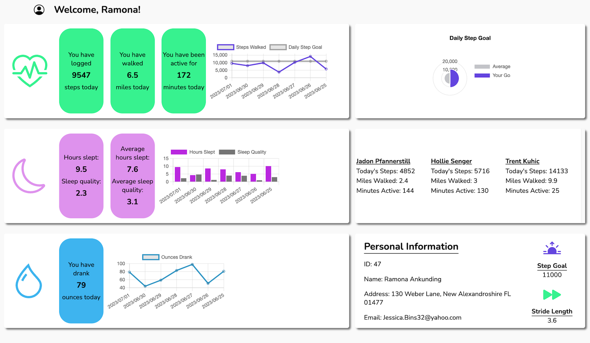

# [Fitlit](https://github.com/tialaaa/fitlit)

### Abstract:
This is an interactive web-based application that was developed to make the user's experience viewing their daily and weekly health stats simple. The user is presented with three sections on the right side of the page,  
all pertaining to their own personal data. They are able to view weekly averages with our custom graphs. The app will display their user information, along with their daily step and stride length. There is also a section  
that will display the user's current friends and some of their activity stats that will inspire the user to be more active.

### Feature Spotlight
We successfully implemented Chart.js as seen in the GIF below. This provides users with an overview of their daily and weekly stats for activity, hydration, and sleep. Our group utilized multiple types of graphs for what  
we believed to be the best visual representation for the user, along with customizing colors to make the app accessible and cohesive with the color themes.

### Installation Instructions:
1. Open the terminal and navigate where you would like to store the application.
1. Click `SSH` and copy and paste `git clone git@github.com:tialaaa/fitlit.git` into your terminal.
1. `cd` into the repository on your local machine and run `npm install` or `npm i` to install project dependencies.
3. Run `npm start` in the terminal to launch the API's server.
4. Open the link to your local server (listed in your terminal) in your web browser to view the live page.
5. `Control + C` is the command to stop running the local server.

### Preview of App:

### Context:

This project was completed in the 10th week of the Turing front-end software engineering program. We were required to synthesize technical information learned thus in the program, in addition to project management skills  
to create a fully functioning site. This project required additional research to implement new technologies.

### Contributors:

- [Tiala](https://github.com/tialaaa)

- [Soyeon](https://github.com/soy-park)

- [Michael](https://github.com/mrlobatoman)

- [Jacob](https://github.com/JacobMacFarlane)

### Learning Goals:

- Use object and array prototype methods to perform data manipulation
- Implement ES6 classes with a complex data model
- Create a user interface that is easy to use and clearly displays information
- Implement a robust testing suite using TDD
- Make network requests to retrieve data

### Technologies Used:
- Fetch API
- Chart.js 3rd party library
- Webpack module bundler
- Git/GitHub/ProjectBoard
- JavaScript
- CSS
- HTML
- Mocha JavaScript testing framework
- Chai assertion library
- Test driven development

### Wins + Challenges:

#### Wins
- Tiala: This was my first project that utilized a third-party library. As a group we felt it was necessary to visually display some of the user’s data, and the chart.js library allowed us to do so. The charts make it easier to  
  digest the information while adding visual interest to the page. We used a CDN (content delivery network) to integrate chart.js within our project’s repository.
- Jacob: This was my first project utilizing fetch and get and learning how to manipulate data from API’s. It was 100% a rocky start but once it clicked it clicked, learning that once we pull the API’s only THEN could we utilize  
  the information was really cool to me!
- Michael: The order of operations. Being able to set up a basic framework, TDD, fetch data, and then display all that data on the page before getting too heavy with css proved to be a really nice/clean workflow. 
- Sara: fetching data, writing tests using TDD, manipulating data via iterator methods, better understanding class-to-class interaction
#### Challenges:

- Tiala: Using the fetch method for API calls brought challenges to this project. Since this was another new concept, it took some trial and error to fully understand how Promises work and how to utilize the information returned in a Promise.
- Michael: Utilizing the promise.all and understanding what was happening took some research and resources. There were some bugs in a couple of our methods that took a lot of time to figure out why our page was displaying incorrect data.
- Sara: Knowing how to use Promise.all for fetched data  
