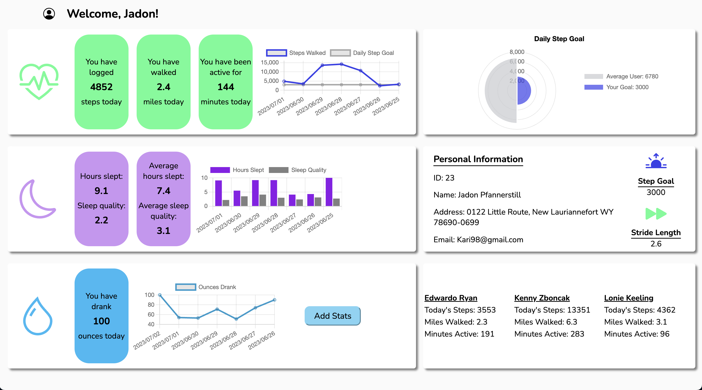

# [Fitlit](https://github.com/tialaaa/fitlit)

### Abstract:
This is an interactive web-based application that was developed to make the user's experience viewing their daily and weekly health stats simple. The user is presented with three sections on the right side of the page, all pertaining to their own personal data. They are able to view weekly averages with our custom graphs. The app will display their user information, along with their daily step and stride length. There is also a section that will display the user's current friends and some of their activity stats that will inspire the user to be more active. The user is able to rearrange the default UI by dragging and dropping the various info cards, and add new Hyrdation data to the dashboard.

### Feature Spotlight
We successfully implemented Chart.js as seen in the GIF below. This provides users with an overview of their daily and weekly stats for activity, hydration, and sleep. Our group utilized multiple types of graphs for what we believed to be the best visual representation for the user, along with customizing colors to make the app accessible and cohesive with the color themes.

### Installation Instructions:
NOTE - This app makes network requests to local server data. You will need to clone down two repositories, install dependencies for both, and run both in separate tabs within your terminal each time you run the app. Follow the below instructions.

1. Open your terminal and navigate to where you would like to store the repositories. **They will need to share a root folder.**
2. Open the local server data repo: https://github.com/turingschool-examples/fitlit-api
3. Using the `SSH` key, paste `git clone git@github.com:turingschool-examples/fitlit-api.git` into your terminal.
4. `cd` into the server's repository on your local machine and run `npm install` or `npm i` to install project dependencies.
5. Run `npm start` to launch the API's server.
6. Open the app's Github repo: https://github.com/tialaaa/fitlit
7. In a new tab within your terminal, paste `git clone git@github.com:tialaaa/fitlit.git` to clone using the `SSH` key. 
8. `cd` into the app's repository on your local machine and run `npm install` or `npm i` to install project dependencies.
9. Run `npm start` to launch this API's server.
10. Open the link to your local server (listed in your terminal) in your web browser to view the live page.
11. `Control + C` is the command to stop running the local server. Run `Control + C` in **both** terminal tabs to fully disconnect.

### Preview of App:

### Context:

This project was completed in the 10th week of the Turing front-end software engineering program. We were required to synthesize technical information learned thus in the program, in addition to project management skills to create a fully functioning site. This project required additional research to implement new technologies.

### Contributors:

- [Tiala](https://github.com/tialaaa)

- [Soyeon](https://github.com/soy-park)

- [Michael](https://github.com/mrlobatoman)

- [Jacob](https://github.com/JacobMacFarlane)

### Learning Goals:

- Use object and array prototype methods to perform data manipulation
- Implement ES6 classes with a complex data model
- Implement a robust testing suite using TDD
- Make network requests using the fetch API to retrieve and post data to a local server
- Create a user interface that is easy to use, clearly displays information, and follows best practices for accessibility
- Conduct a usability test and implement feedback to improve product

### Technologies Used:
- Fetch API
- Chart.js 3rd party library
- Micromodal.js 3rd party library
- Webpack module bundler
- Git/GitHub/ProjectBoard
- JavaScript
- CSS
- HTML
- Mocha JavaScript testing framework
- Chai assertion library
- Test driven development

### Wins + Challenges:

#### Wins
- Tiala: This was my first project that utilized a third-party library. As a group we felt it was necessary to visually display some of the user’s data, and the chart.js library allowed us to do so. The charts make it easier to digest the information while adding visual interest to the page. We used a CDN (content delivery network) to integrate chart.js within our project’s repository.
- Jacob: This was my first project utilizing fetch and get and learning how to manipulate data from API’s. It was 100% a rocky start but once it clicked it clicked, learning that once we pull the API’s only THEN could we utilize the information was really cool to me!
- Michael: The order of operations. Being able to set up a basic framework, TDD, fetch data, and then display all that data on the page before getting too heavy with css proved to be a really nice/clean workflow. 
- Sara: fetching data via GET, posting data via POST, utilizing a third-party library called chart.js and installing its packages, writing tests using TDD, manipulating data via iterator methods, understanding class-to-class interaction, importing/exporting files with correct syntax, being comfortable with writing HTML and CSS from scratch

#### Challenges:
- Tiala: Using the fetch method for API calls brought challenges to this project. Since this was another new concept, it took some trial and error to fully understand how Promises work and how to utilize the information returned in a Promise.
- Michael: Utilizing the promise.all and understanding what was happening took some research and resources. There were some bugs in a couple of our methods that took a lot of time to figure out why our page was displaying incorrect data.
- Sara: Using Promise.all for fetched data, discussing code more in-depth with my teammates and being on the same page as them in terms of thought processes
- Group: Implementing HTML5's native drag-and-drop features for UI rearrangement, while making sure the Charts still rendered correctly after rearranging the widget cards.
